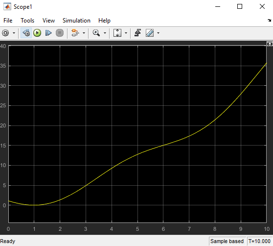
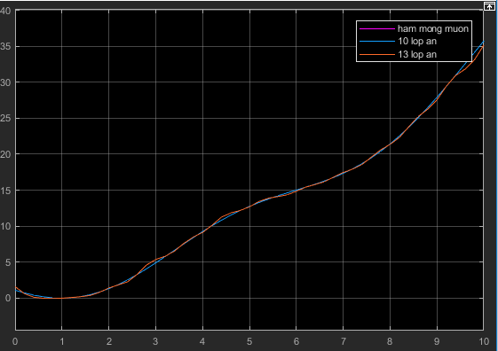

# approximation-of-nonlinear-function-with-ANN-Matlab-Simulink-
Approximation of nonlinear function with ANN ( Matlab Simulink )

Ex Function : 0.3*x^2-2*sin(x)+log(x^2+3) with 0<x<10

Result

## Quick Run :
Step 1 : Edit the function you want and Run file approximation_of_nonlinear_function.slx to get input and output data 
Step 2 : Run file approximation_of_nonlinear_function.m to train and make ANN block
Step 3 : Copy ANN block to new file.slx, combine with clock block and scope block to see the result

* Note : You can change parameters like activation function, learning rate, hidden layers to get the beat results 

